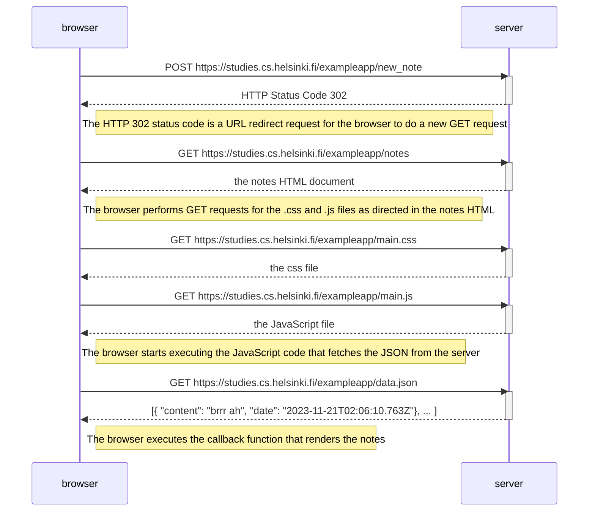

```mermaid
sequenceDiagram
    participant browser
    participant server

    browser->>server: POST https://studies.cs.helsinki.fi/exampleapp/new_note
    activate server
    server-->>browser: HTTP Status Code 302
    deactivate server
    
    Note right of browser: The HTTP 302 status code is a URL redirect request for the browser to do a new GET request

    browser->>server: GET https://studies.cs.helsinki.fi/exampleapp/notes
    activate server
    server-->>browser: the notes HTML document
    deactivate server

    Note right of browser: The browser performs GET requests for the .css and .js files as directed in the notes HTML


    browser->>server: GET https://studies.cs.helsinki.fi/exampleapp/main.css
    activate server
    server-->>browser: the css file
    deactivate server

    browser->>server: GET https://studies.cs.helsinki.fi/exampleapp/main.js
    activate server
    server-->>browser: the JavaScript file
    deactivate server

    Note right of browser: The browser starts executing the JavaScript code that fetches the JSON from the server

    browser->>server: GET https://studies.cs.helsinki.fi/exampleapp/data.json
    activate server
    server-->>browser: [{ "content": "brrr ah", "date": "2023-11-21T02:06:10.763Z"}, ... ]
    deactivate server

    Note right of browser: The browser executes the callback function that renders the notes
```
